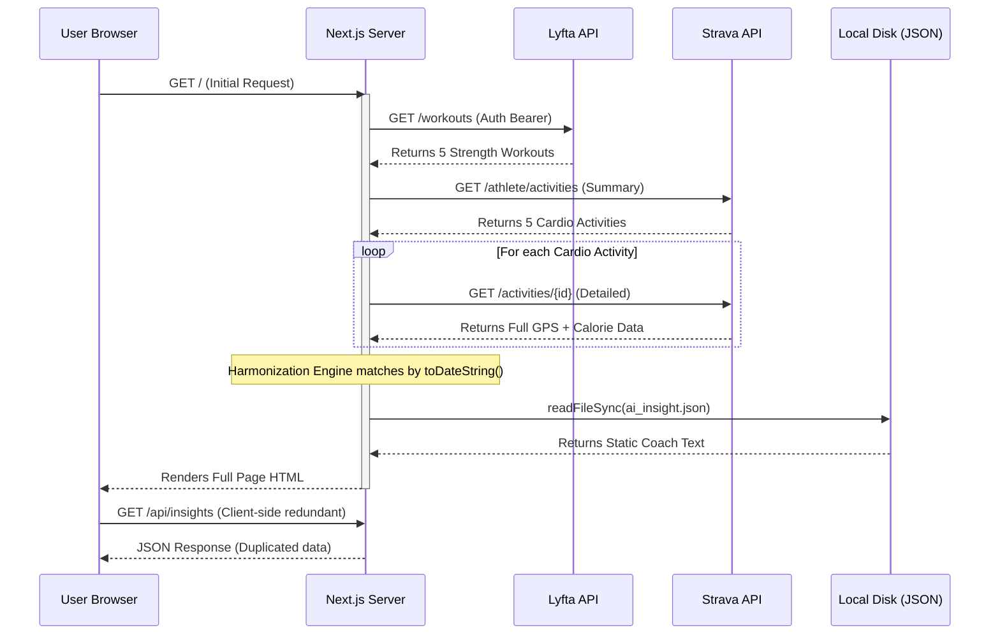

# Deep-Dive Technical Audit: Project Ascend
**Architectural Rigor & Risk Assessment**  
**Date:** April 29, 2026  

---

## 1. Deep Codebase Analysis

### 🧠 The "Network Boundary" Paradox
Currently, the app fetches Strava/Lyfta data via **Server Components** (good), but fetches AI Insights via a **Client-Side `useEffect`** (inefficient).
*   **The Flaw:** `InsightsPanel.js` makes an unnecessary network request to `/api/insights`, which in turn reads `ai_insight.json` from the server disk.
*   **The Impact:** This forces the user to see a "shimmering skeleton" loader for data that is already sitting on the server.
*   **The Fix:** Inject the AI insight directly into the `Home` component on the server and pass it as a prop. This eliminates the API route and one extra round-trip to the server.

### 🕒 The "Midnight Bug" (Timezone Fragility)
The **Harmonization Engine** uses strict date matching:  
`lyfta.date.toDateString() === strava.date.toDateString()`
*   **The Flaw:** This assumes both APIs and the server share the same timezone context. 
*   **The Risk:** If a user logs a 11:45 PM session in Singapore (UTC+8) and Strava reports it in UTC (3:45 PM), the strings will match. However, if the server logic shifts, these workouts will "de-sync," showing a strength workout and a cardio workout as separate days when they were one session.
*   **The Fix:** Transition to `Unix Timestamps` and a "proximity window" (e.g., if workouts are within 3 hours of each other, they are likely the same session).

### 🏋️‍♂️ Muscle Parsing: "Magic String" Dependency
The `parseLyftaMuscles` function is highly coupled to Lyfta's internal naming conventions:
```javascript
if (url.includes("_Chest")) muscles.push("chest");
```
*   **The Flaw:** We are "scraping" meaning from image URLs. This is an unofficial, undocumented API. 
*   **The Impact:** This is the most likely piece of code to break silently. If Lyfta updates their UI, your heatmap will stop working without any error logs.
*   **The Fix:** Build a manual "Mapping Table" based on Lyfta's `exercise_id` instead of its URL strings.

---

## 2. Advanced Risk & Longevity Matrix

| Technical Vector | Deep-Dive Analysis | Confidence | Priority |
| :--- | :--- | :---: | :---: |
| **Auth: Token Deadlock** | Strava's `STRAVA_ACCESS_TOKEN` is hardcoded. Since it expires every 6 hours, the app has a 75% "Down Time" probability if not actively maintained. | **10/10** | **P0** |
| **Performance: Event Loop Blocking** | `fs.readFileSync` in `env.js` and `route.js` is **synchronous**. In a Node.js environment, this stops all other processes until the file is read. | **4/10** | **P2** |
| **Scaling: Detailed Fetch Overkill** | Fetching the full `DetailedActivity` object for every workout retrieves megabytes of GPS "streams" we never use. This is inefficient memory management. | **8/10** | **P1** |
| **Privacy: Data Leakage** | By fetching GPS data into the server memory (even if not displayed), we are technically "processing" sensitive location data. | **6/10** | **P2** |

---

## 3. Functional Blindspots (Detailed)

### 🚨 Unauthorized (401) Handling
When a token expires, the Strava API returns a `401 Unauthorized`. 
*   **Current Behavior:** The code checks `if (stravaRes.ok)`. Since a 401 is *not* ok, it simply returns an empty list. 
*   **Result:** The user sees a blank dashboard and assumes they have no workouts, rather than realizing they need to re-authenticate.

### 🛡️ Security of `CREDENTIALS_BACKUP.md`
The "Smart Loader" is a convenience, but it encourages storing master secrets in plain-text markdown.
*   **The Risk:** Most developers use "Git Auto-Commit" or "Save All" tools. One accidental click and your `CLIENT_SECRET` is on the public internet.
*   **Recommendation:** Use an encrypted `.env.gpg` or a dedicated secret manager (Vault/Vercel).

---

## 4. System Visualization: Life of a Data Point



---

## 5. Production Readiness Checklist (P0-P1)

1.  **[P0] Middleware Token Refresh:** Implement a pre-fetch check. If the Strava token is >5 hours old, use the `REFRESH_TOKEN` to swap it *before* the main data fetch begins.
2.  **[P1] Field Filtering:** If possible, reduce the `DetailedActivity` response to only the required fields to save memory.
3.  **[P1] Unit Normalization:** Explicitly handle `kg` to `lbs` conversion based on a user setting, rather than assuming `kg`.
4.  **[P1] Error UI:** Replace "No workouts found" with specific error cards (e.g., "Strava Connection Expired").

---

## 6. Omni-Audit: Final Critique

### The "Hidden Debt" of Vibe-Coding
We have prioritized **"Visual Wow"** (SVG heatmaps, shimmer loaders) over **"Reliability"**. 
*   **The Verdict:** The app is a "High-Fidelity Prototype." It is beautiful but fragile. If any external factor (Lyfta URL, Strava Auth, Node Version) shifts by 1%, the app will crash.
*   **The Missing Link:** We need **Zod Schema Validation**. We should validate the data coming from APIs *before* we try to parse it. If Strava changes its data shape, we should show a "Data Format Changed" error rather than a cryptic `TypeError: undefined is not an object`.

---
*Audit by Antigravity. Focus: Stability & Production Integrity.*
